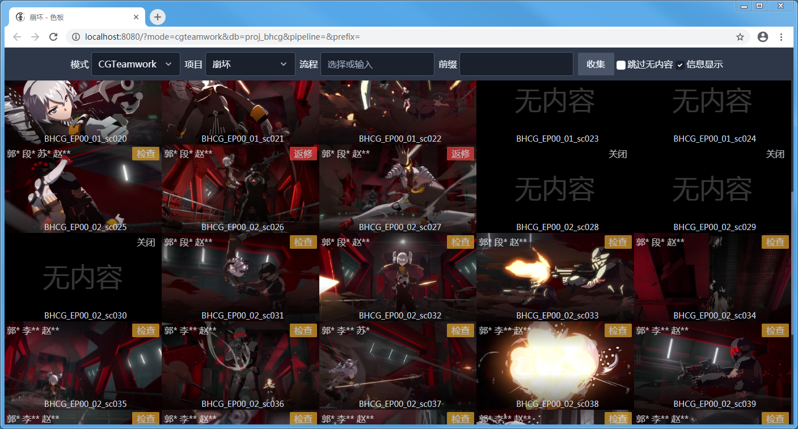
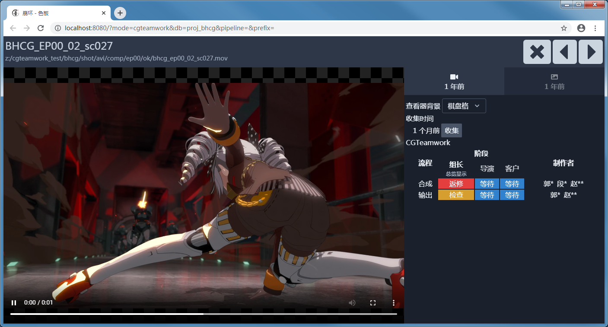

# 色板服务器

[项目主页](https://github.com/WuLiFang/csheet)
[文档](https://wulifang.github.io/csheet/)

## 功能

- [x] 实时更新
- [x] 自动视频转码
- [x] 自动生成缩略图
- [x] 与 CGTeamwork5.2 集成

## 部署

使用 docker 构建。

配置参考 [deployments](./deployments) 文件夹下的示例文件。

## 开发

使用 [gotmpl](https://github.com/NateScarlet/gotmpl) 进行代码生成。

## NO LICENSE 版权保留

吾立方内部使用, 其他人使用需先联系获取授权

[源代码]: https://github.com/WuLiFang/csheet/archive/master.zip
