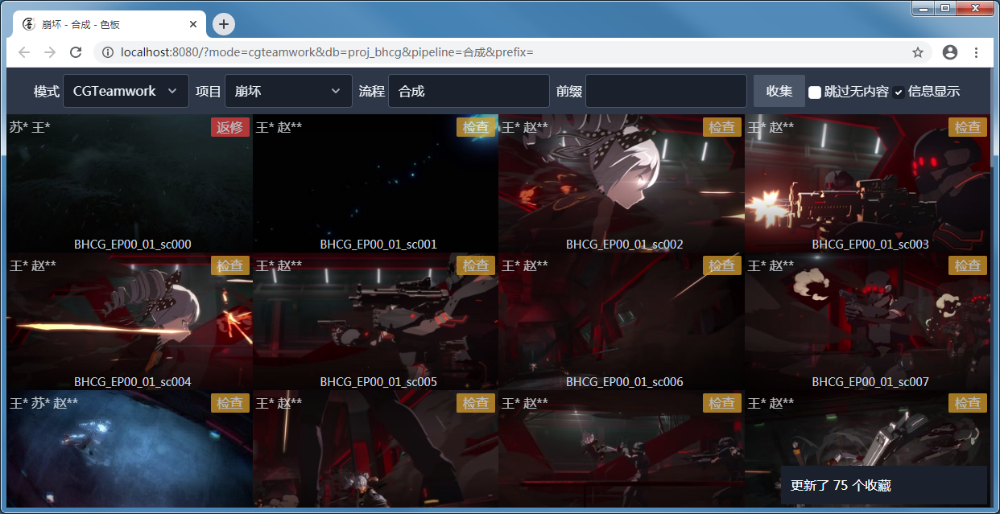

从 CGTeamwork 收集
===========================

使用 CGTeamwork 模式需要在服务端配置 CGTeamwork 的账号密码，所有查询配置的账号进行。
色板用户无需拥有 CGTeamwork 账号。

从导航栏表单收集
--------------------------

将在导航栏模式设为 CGTeamwork，会显示以下表单：

项目

  选择要收集的 CGTeamwork 项目。

  .. figure:: ../_images/chrome_2020-09-03_14-12-02.png

    提供当前 CGTeamwork 上的所有活动项目作为选项。

流程

  选择要收集的流程名，支持输入任意字符串，将对匹配流程的任务提交文件进行收集。

  通常流程名等同于 CGTeamwork 上设置的流程名，但服务端可设置流程名覆盖来更改使用指定流程名匹配到的任务。

  .. figure:: ../_images/chrome_2020-09-03_14-06-19.png

    会根据设置和历史收集提供自动完成。

前缀

  使用前缀匹配镜头名，将跳过所有镜头名不以输入值开头的任务。

  .. figure:: ../_images/chrome_2020-09-03_14-09-16.png

    会根据自动历史收集的共通前缀提供自动完成。

校验
~~~~~~~~~~~~~~~~~~~~~

表单在提交前会进行校验，并在对应的输入上提示错误。

.. figure:: ../_images/chrome_2020-09-03_15-48-49.png

  项目为必填项。

  流程为必填项。

返回结果
~~~~~~~~~~~~~~~~~~~~~

成功收集完成会在右下角提示本次收集的结果。

如果匹配任务过多，会提示更改前缀，需要前缀更改后才能再次提交表单。
