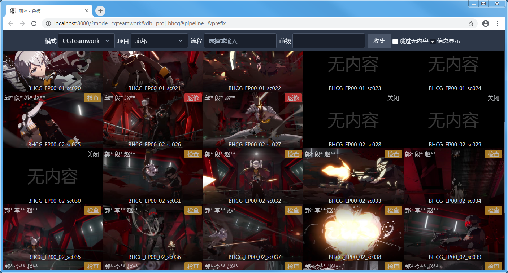

使用总览视图
==========================

应用默认即为总览视图，展示所有匹配的收藏。

视图使用网格布局，根据窗口宽度自动调整列数，最小 1 列，最大 6 列。

使用导航栏
---------------------

视图上方为导航栏，用于设置匹配条件。

选择模式后，可使用导航栏的表单设置匹配条件。

点击收集按钮即可根据当前匹配条件进行新的收集。

参见：

- :doc:`collect-from-cgteamwork`
- :doc:`collect-from-folder`

自动隐藏
~~~~~~~~~~~~~~~~~~~~~~~~

  隐藏导航栏

当向下滚动视图时，导航栏会自动隐藏以提供更大的显示区域。

要取消隐藏向上滚动视图即可。

跳过无内容
--------------------------

有时候会收集到没有展示内容的收藏，此时将会显示为无内容收藏。

可在导航栏中选择跳过无内容进行跳过。

信息显示
----------------------

在每个单元格上使用覆盖层显示对应收藏的额外信息。

标题
----------------

在底部会显示收藏的标题。

CGTeamwork 制作者
-----------------------------

对 CGTeamwork 模式收集的收藏可用。

在左上角显示制作者当前任务流程对应的制作者，多个制作者名称之间会有间距。

CGTeamwork 任务状态
-----------------------------

对 CGTeamwork 模式收集的收藏可用。

在右上角显示对应总览显示阶段的所有任务状态中优先级最高的值。

总览显示阶段可在查看器中设置，参见 :doc:`use-viewer` 。

任务状态优先级从高到底为：

- 关闭
- 返修
- 检查
- 等待
- 通过
- 其他

隐藏覆盖层
----------------------------

.. image:: ../_images/chrome_2020-09-03_13-53-50.png

在导航栏中可以取消 :guilabel:`信息显示` 的勾选，会记录对此项的变更于浏览器的本地存储中，下次使用时自动使用和上次相同的设置。 

无限滚动
--------------------

总览默认显示匹配的前 50 个收藏。

.. image:: ../_images/chrome_2020-09-03_15-05-51.png

当滚动到视图底部，或者用户点击 :guilabel:`加载更多` 按钮时将在尾部加载后续的 50 个收藏。

  加载状态
