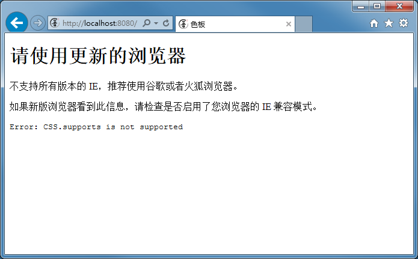

.. csheet documentation master file, created by
   sphinx-quickstart on Mon Jul  1 10:44:31 2019.
   You can adapt this file completely to your liking, but it should at least
   contain the root `toctree` directive.

吾立方色板网页客户端软件 文档
==================================

.. image:: _images/chrome_2020-09-03_11-57-08.png

可访问服务器部署的地址来浏览色板。

本软件是一个单网页应用。

如果不带参数进行访问，会自动恢复上次使用的状态。

收藏和展示均为实时数据更新，无需手动刷新页面。

.. toctree::
  :maxdepth: 2

  how-to

浏览器要求
----------------------------

在访问时色板会自动检测浏览器兼容性，如不支持会显示以下错误信息：

